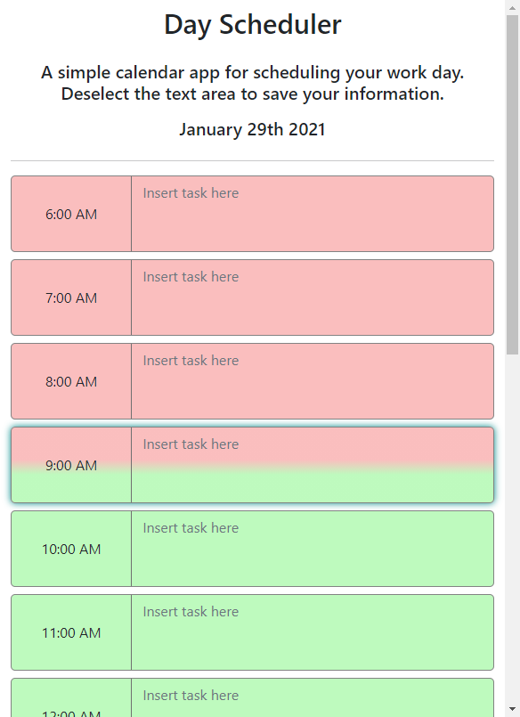

# 05 Third-Party APIs: Work Day Scheduler

This is a simple day planner made in HTML and JS, taking advantage
of jQuery and MomentJS to perform API functions and handle date/time
information. 

## Link to live website
http://sinsinkun.github.io/UTOR-Scheduler

## Screenshot

